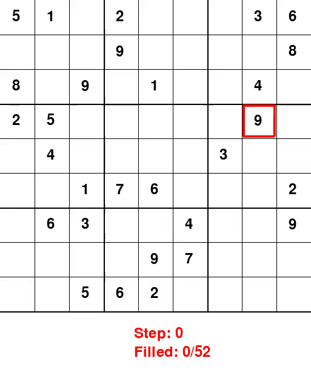
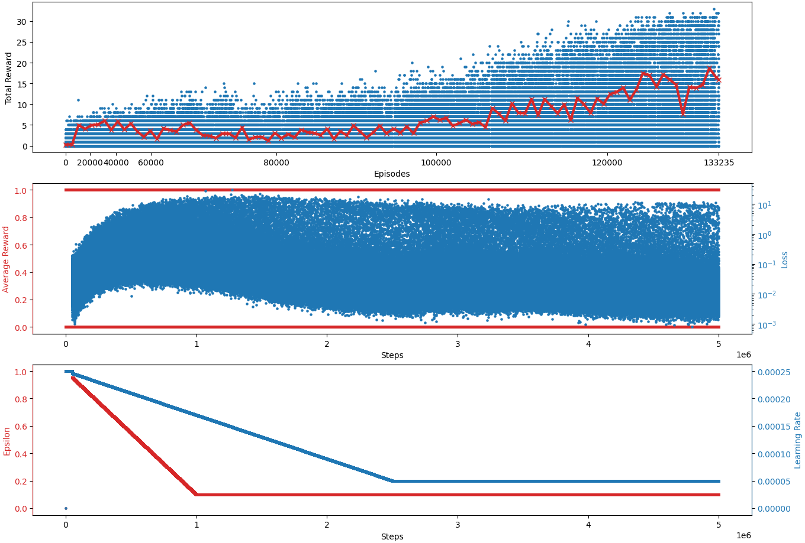
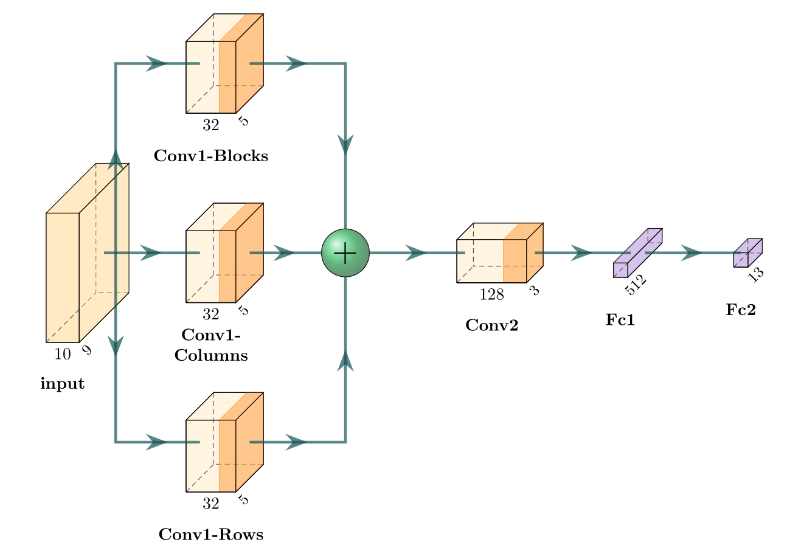

# Sudoku
Solving Soduku

### Dataset

Download the [3 million Sudoku puzzles with ratings](https://www.kaggle.com/datasets/radcliffe/3-million-sudoku-puzzles-with-ratings) dataset. Put the file "sudoku-3m.csv" in the `<sudoku/configs/data>` folder.

### Results

Random agent                           | Trained agent
:-------------------------------------:|:----------------------------------:
 | 

Learning steps:

Model description:

