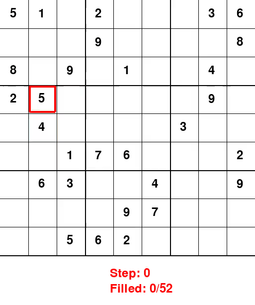

# Sudoku

Solving Soduku


### Dataset

Download the [3 million Sudoku puzzles with ratings](https://www.kaggle.com/datasets/radcliffe/3-million-sudoku-puzzles-with-ratings) dataset. Put the file "sudoku-3m.csv" in a `<data>` folder, located in the same directory as the `main.py` file.


## Play

Install the requirements in a custom Python 3.11 environment.
```console
usr@desktop:~$ python -m venv game_env
usr@desktop:~$ source game_env/bin/activate
(game_env) usr@desktop:~$ pip install -r requirements.txt
```

Use the script `main.py` to launch a game.
```console
(game_env) usr@desktop:~$ python main.py --game sudoku --render-mode human --playing-mode manual
```

Available arguments are:

- `--game` to select the game to play, available choices are:
    - `sudoku` (default) try to correctly fill a Sudoku grid
    - `snake` on a 18x18 grid, try to grow a snake without dying
- `--render-mode` to fix how the game will be rendered, available choices are:
    - `rgb_array` (default) to save results in frames aggregated in a video file
    - `human` to display results in a GUI
    - `ansi` to display results in console (only available with sudoku)
- `--playing-mode` to play manualy or automaticly, available choices are:
    - `learning` (default) let the AI do the game
    - `manual` play by yourself


### Results

Random agent                           | Trained agent
:-------------------------------------:|:----------------------------------:
 | 


Learning steps:


Model description:


